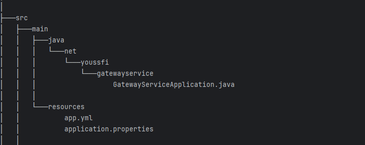
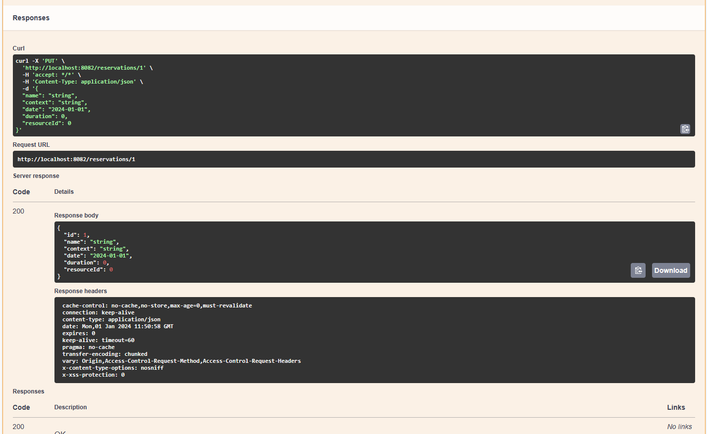
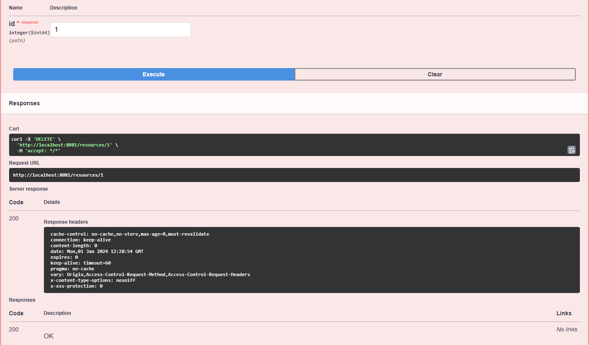

## Overview of the Project

This project is designed to develop a reservation management application following a microservices architecture. The primary goal is to efficiently handle reservations for various resources, with each reservation being associated with a specific resource.

A resource is characterized by its unique ID, name, and type, such as MATERIEL_INFO or MATERIEL_AUDIO_VISUEL. On the other hand, a reservation is identified by its ID, name, context, date, duration, and is initiated by a person. A person is defined by their ID, name, email, and function.

The application comprises two functional microservices:

1. **Resources-Service:** Responsible for managing resources.
2. **Reservation-Service:** Manages reservations initiated by individuals.

The technical microservices to be implemented include:

- **Service Gateway:** Built on Spring Cloud Gateway.
- **Service Discovery:** Utilizing Eureka Server.
- **Service Configuration:** Employing Spring Cloud Config.

For the overall application:

- A web frontend will be developed using the Angular framework.
- Security protocols will be based on OAuth2 and OIDC, with Keycloak serving as the identity provider.
- Microservices will generate RESTful web service documentation using the OpenAPI Specification Swagger.
- Circuit breakers, implemented through Resilience4J, will enhance fault tolerance within the system.
- 
## Outils


## App Tree Architect:

```bash
├───app-ng
│   ├───.angular
│   │   └───cache
│   │       └───17.0.8
│   │           ├───angular-webpack
│   │           │   ├───37adeeb720adad8fa4ae080264c27bb01d6d29de
│   │           │   ├───408bf4a2ff9333ba12aa88d2aa40a2cdaff0ee80
│   │           │   └───6a78ae494bfa0410eaa3259b7efa0e385ca22404
│   │           └───babel-webpack
│   ├───.firebase
│   ├───.idea
│   ├───.vscode
│   ├───dist
│   │   └───app-ng
│   │       └───assets
│   │           ├───css
│   │           ├───img
│   │           └───js
│   ├───public
│   └───src
│       ├───app
│       │   ├───component
│       │   │   ├───admin-template
│       │   │   ├───client
│       │   │   │   ├───add-client
│       │   │   │   └───edit-client
│       │   │   ├───header
│       │   │   ├───reservations
│       │   │   ├───resources
│       │   │   └───welcome
│       │   ├───guards
│       │   ├───models
│       │   ├───pipes
│       │   └───services
│       └───assets
│           ├───css
│           ├───img
│           └───js
├───config-service
│   ├───.mvn
│   │   └───wrapper
│   ├───src
│   │   ├───main
│   │   │   ├───java
│   │   │   │   └───net
│   │   │   │       └───youssfi
│   │   │   │           └───configservice
│   │   │   └───resources
│   │   └───test
│   │       └───java
│   │           └───net
│   │               └───youssfi
│   │                   └───configservice
│   └───target
│       ├───classes
│       │   └───net
│       │       └───youssfi
│       │           └───configservice
│       ├───generated-sources
│       │   └───annotations
│       ├───generated-test-sources
│       │   └───test-annotations
│       ├───maven-archiver
│       ├───maven-status
│       │   └───maven-compiler-plugin
│       │       ├───compile
│       │       │   └───default-compile
│       │       └───testCompile
│       │           └───default-testCompile
│       └───test-classes
│           └───net
│               └───youssfi
│                   └───configservice
├───discovery-service
│   ├───.mvn
│   │   └───wrapper
│   ├───src
│   │   ├───main
│   │   │   ├───java
│   │   │   │   └───net
│   │   │   │       └───youssfi
│   │   │   │           └───discoveryservice
│   │   │   └───resources
│   │   └───test
│   │       └───java
│   │           └───net
│   │               └───youssfi
│   │                   └───discoveryservice
│   └───target
│       ├───classes
│       │   └───net
│       │       └───youssfi
│       │           └───discoveryservice
│       ├───generated-sources
│       │   └───annotations
│       ├───generated-test-sources
│       │   └───test-annotations
│       ├───maven-archiver
│       ├───maven-status
│       │   └───maven-compiler-plugin
│       │       ├───compile
│       │       │   └───default-compile
│       │       └───testCompile
│       │           └───default-testCompile
│       └───test-classes
│           └───net
│               └───youssfi
│                   └───discoveryservice
├───gateway-service
│   ├───.mvn
│   │   └───wrapper
│   ├───src
│   │   ├───main
│   │   │   ├───java
│   │   │   │   └───net
│   │   │   │       └───youssfi
│   │   │   │           └───gatewayservice
│   │   │   └───resources
│   │   └───test
│   │       └───java
│   │           └───net
│   │               └───youssfi
│   │                   └───gatewayservice
│   └───target
│       ├───classes
│       │   └───net
│       │       └───youssfi
│       │           └───gatewayservice
│       ├───generated-sources
│       │   └───annotations
│       ├───generated-test-sources
│       │   └───test-annotations
│       ├───maven-archiver
│       ├───maven-status
│       │   └───maven-compiler-plugin
│       │       ├───compile
│       │       │   └───default-compile
│       │       └───testCompile
│       │           └───default-testCompile
│       └───test-classes
│           └───net
│               └───youssfi
│                   └───gatewayservice
├───reservation-service
│   ├───.mvn
│   │   └───wrapper
│   ├───src
│   │   ├───main
│   │   │   ├───java
│   │   │   │   └───yas
│   │   │   │       └───kr
│   │   │   │           └───reservationservice
│   │   │   │               ├───clients
│   │   │   │               ├───dtos
│   │   │   │               ├───entities
│   │   │   │               ├───exceptions
│   │   │   │               ├───mappers
│   │   │   │               ├───model
│   │   │   │               ├───repository
│   │   │   │               ├───security
│   │   │   │               ├───services
│   │   │   │               └───web
│   │   │   └───resources
│   │   │       ├───static
│   │   │       └───templates
│   │   └───test
│   │       └───java
│   │           └───yas
│   │               └───kr
│   │                   └───reservationservice
│   └───target
│       ├───classes
│       │   └───yas
│       │       └───kr
│       │           └───reservationservice
│       │               ├───clients
│       │               ├───dtos
│       │               ├───entities
│       │               ├───exceptions
│       │               ├───mappers
│       │               ├───model
│       │               ├───repository
│       │               ├───security
│       │               ├───services
│       │               └───web
│       ├───generated-sources
│       │   └───annotations
│       ├───generated-test-sources
│       │   └───test-annotations
│       ├───maven-archiver
│       ├───maven-status
│       │   └───maven-compiler-plugin
│       │       ├───compile
│       │       │   └───default-compile
│       │       └───testCompile
│       │           └───default-testCompile
│       └───test-classes
│           └───yas
│               └───kr
│                   └───reservationservice
└───resources-service
    ├───.mvn
    │   └───wrapper
    ├───src
    │   ├───main
    │   │   ├───java
    │   │   │   └───yas
    │   │   │       └───kr
    │   │   │           └───resourcesservice
    │   │   │               ├───dtos
    │   │   │               ├───entities
    │   │   │               ├───enums
    │   │   │               ├───mappers
    │   │   │               ├───repository
    │   │   │               ├───security
    │   │   │               ├───service
    │   │   │               └───web
    │   │   └───resources
    │   └───test
    │       └───java
    │           └───yas
    │               └───kr
    │                   └───resourcesservice
    └───target
        ├───classes
        │   └───yas
        │       └───kr
        │           └───resourcesservice
        │               ├───dtos
        │               ├───entities
        │               ├───enums
        │   └───test-annotations
        ├───maven-archiver
        ├───maven-status
        │   └───maven-compiler-plugin
        │       ├───compile
        │       │   └───default-compile
        │       └───testCompile
        │           └───default-testCompile
        └───test-classes
            └───yas
                └───kr
                    └───resourcesservice
```

## Eureka Service 
<table align="center">

   <td></td>
  </tr>
</table>
<br>

## Config Service
<table align="center">
  <tr>
    <th>Config Architect</th>
    <th>Config Test</th>
  </tr>
  <tr>
    <td></td>
    <td></td>
  </tr>
</table>
<be>

## Gateway Service
<table align="center">
  <tr>
    <th>Gateway Architect</th>
    <th>Gateway health</th>
  </tr>
  <tr>
    <td></td>
    <td></td>
  </tr>
</table>
<br>

## Reservation Service Swagger Doc:
<table align="center">
  <tr>
    <th>Reservation Rest API</th>
    <th>Personne Rest API</th>
   </tr>
  <tr>
    <td></td>
    <td></td>
  </tr>
    <th>GET Reservation</th>
    <th>GET Person</th>
  <tr>
    <td></td>
    <td></td>
  </tr>
  </tr>
    <th>GET ALL Reservations</th>
    <th>GET ALL Persons</th>
  <tr>
    <td></td>
    <td></td>
  </tr>
     <th>PUT Reservation</th>
     <th>PUT Person</th>
  <tr>
    <td></td>
    <td></td>
  </tr>
     <th>DELETE Reservation</th>
    <th>DELETE Person</th>
  <tr>
    <td></td>
    <td></td>
  </tr>
     <th>POST Reservation</th>
    <th>POST Person</th>
  <tr>
    <td></td>
    <td></td>
  </tr>
</table>
<br>

## Resources Service Swagger Doc:

<table align="center">
  <tr>
    <th>Reservation Rest API</th>
   </tr>
  <tr>
    <td></td>
  </tr>
     <tr>
    <th>GET Resource</th>
   </tr>
  <tr>
    <td></td>
  </tr>
     <tr>
    <th>GET ALL Resources</th>
   </tr>
  <tr>
    <td></td>
  </tr>
     <tr>
    <th>PUT Resource</th>
   </tr>
  <tr>
    <td></td>
  </tr>
     <tr>
    <th>DELETE Resource</th>
   </tr>
  <tr>
    <td></td>
  </tr>
     <tr>
    <th>POST Resource</th>
   </tr>
  <tr>
    <td></td>
  </tr>
</table>


## Angular Frontend:

<table align="center">
  <tr>
    <th>Login With Keycloack</th>
  </tr>
  <tr>
    <td></td>
  </tr>
     <tr>
    <th>Welcom Mockup</th>
  </tr>
  <tr>
    <td></td>
  </tr>
     <tr>
    <th>Resources Management Mockup</th>
  </tr>
  <tr>
    <td></td>
  </tr>
     <tr>
    <th>Reservations Management Mockup</th>
  </tr>
  <tr>
    <td></td>
  </tr>
     <tr>
    <th>Persons Management Mockup</th>
  </tr>
  <tr>
    <td></td>
  </tr>
    
</table>
<br>


## Full App Dockerisation:
```yaml
services:
  exam-discovery-service:
    #The docker file in scrum-app build the jar and provides the docker image with the following name.
    build: ./discovery-service
    container_name: exam-discovery-service
    ports:
      - '8761:8761'
    expose:
      - '8761'
    healthcheck:
      test: [ "CMD", "curl", "-f", "http://localhost:8761/actuator/health" ]
      interval: 10s
      retries: 5
  exam-config-service:
    build: ./config-service
    container_name: exam-config-service
    ports:
      - '9999:9999'
    expose:
      - '9999'
    depends_on:
      exam-discovery-service:
        condition: service_healthy
    healthcheck:
      test: [ "CMD", "curl", "-f", "http://localhost:9999/actuator/health" ]
      interval: 10s
      retries: 5
    environment:
      - DISCOVERY_SERVICE_URL=http://exam-discovery-service:8761/eureka

  exam-resources-service:
    build: ./resources-service
    container_name: exam-resources-service
    ports:
      - '8081:8081'
    expose:
      - '8081'
    depends_on:
      exam-config-service:
        condition: service_healthy
#    healthcheck:
#      test: [ "CMD", "curl", "-f", "http://localhost:8081/actuator/health" ]
    environment:
      - DISCOVERY_SERVICE_URL=http://exam-discovery-service:8761/eureka
      - CONFIG_SERVER_URL=http://exam-config-service:9999/
  exam-reservation-service:
    build: ./reservation-service
    container_name: exam-reservation-service
    ports:
      - '8082:8082'
    expose:
      - '8082'
    depends_on:
      - exam-resources-service
    environment:
      - DISCOVERY_SERVICE_URL=http://exam-discovery-service:8761/eureka
      - CONFIG_SERVER_URL=http://exam-config-service:9999/

  exam-gateway-service:
    build: ./gateway-service
    container_name: exam-gateway-service
    ports:
      - '8899:8888'
    expose:
      - '8899'
    depends_on:
      exam-config-service:
        condition: service_healthy
    environment:
      - DISCOVERY_SERVICE_URL=http://exam-discovery-service:8761/eureka
      - CONFIG_SERVER_URL=http://exam-config-service:9999/

  postgres-service:
    image: postgres
    container_name: postgres-service
    volumes:
      - postgres-data:/var/lib/postgresql/data
    environment:
      POSTGRES_DB: keycloak
      POSTGRES_USER: keycloak
      POSTGRES_PASSWORD: k1234
    ports:
      - '5432:5432'
    expose:
      - '5432'
    healthcheck:
      test: "exit 0"
  pgadmin4:
    image: dpage/pgadmin4
    container_name: pgadmin4
    restart: always
    ports:
      - "8888:80"
    environment:
      PGADMIN_DEFAULT_EMAIL: keycloak@gmail.com
      PGADMIN_DEFAULT_PASSWORD: azer
    volumes:
      - pgadmin-data:/var/lib/pgadmin
  keycloak:
    image: quay.io/keycloak/keycloak:latest
    container_name: keycloak
    environment:
      KC_DB: postgres
      KC_DB_URL: jdbc:postgresql://postgres-service:5432/keycloak
      KC_DB_USERNAME: keycloak
      KC_DB_PASSWORD: k1234
      KEYCLOAK_ADMIN: admin
      KEYCLOAK_ADMIN_PASSWORD: admin
    command:
      - start-dev
    restart: always
    ports:
      - '8080:8080'
    expose:
      - '8080'
    depends_on:
      postgres-service:
        condition: service_healthy
  app-ng:
    build: ./app-ng
    container_name: exam-app-ng
    ports:
      - '8085:4200'
    expose:
      - '8085'
    restart: always

volumes:
  postgres-data:
  pgadmin-data:
```
